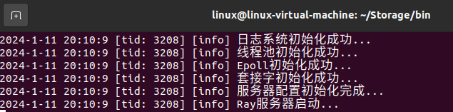

# Storage

## 项目简介

### 项目结构

`Storage`由一个基于C++的`http`服务器和一个动态库形式的存储引擎构成。存储引擎和服务器之间的接口层通过头文件`Processor.h`描述。不同的存储引擎按照不同的方式实现`Processor`接口，并将编译构建出的动态库放在特定的目录下，即可得到不同的可对外提供服务的存储引擎。

整体结构分成以下三层：

* 服务器层：`http`报文经过一定的解析和处理后，传递给接口层（即`Processor`）。
* 接口层：调用存储引擎，处理服务器层传递过来的数据，并将处理结果封装后返回给服务器层。
* 存储引擎：给接口层提供API。

Storage的优势：C++ 服务器的性能良好；更换存储引擎方便快捷；轻量级，即开即用，无需安装其他依赖。

### HTTP服务器

`http`服务器包含的模块如下：

* 异步的日志系统，方便在开发中进行调试以及在服务器运行时监控服务器的运行状态。
* 单例模式的线程池，避免频繁创建和销毁线程带来的额外开销。
* 基于小根堆的定时器，用于清除到期的非活跃的连接。
* 自定义的可以自动增长的缓冲区，用于读取文件中的数据或者向文件中写数据。
* 封装epoll函数，使用I/O多路复用监听文件描述符的状态。
* 利用正则表达式和状态机解析`http`请求报文，根据处理结果构造`http`响应报文。

实现细节见`http`服务器文档：[HTTP服务器文档](./http_server/README.md)

### K-V存储引擎

`Storage`实现了基于跳表的轻量级K-V存储引擎，对外提供增删改查API，以及数据落盘API。接口层`Processor`从用户的`http`请求报文中解析出存储引擎的操作命令，根据命令调用相应的函数，并根据函数的返回结果返回`http`响应体。

实现细节见K-V存储引擎文档：[K-V存储引擎文档](./kv_store/README.md)

## 目录结构

```python
-bin				# 存放二进制文件
 --lib				# 存储引擎动态库目录
  ---processor.so	# 存储引擎动态库
 --config.ini		# 服务器配置文件
 --http_server		# http服务器（可执行程序）
-http_server		# C++ http服务器
 --Buffer			# 自动增长的缓冲区
 --Epoll			# epoll相关函数封装
 --Log				# 异步日志系统
 --Server			# 通信主循环
 --ThreadPool		# 线程池
 --Timer			# 基于小根堆的定时器
 --Connection		# 客户端连接封装
 --HttpProcess		# HTTP解析器和构造器
 --Processor		# 存储引擎接口（存储引擎和http服务器对接层）
 --main.cpp			# 主程序（启动程序）
 --config.ini		# 服务器启动时要读取的配置文件
 --CMakeLists.txt	# CMake
 --README.md		# 说明文件
-kv_store			# 基于跳表的轻量级K-V存储引擎
-.gitignore			# git忽略
-LICENSE			# Apache2.0 开源许可
-README.md			# README.md文件，Storage的说明文件
```

## 编译和运行

`Storage`由一个`http`服务器和一个动态库形式的存储引擎构成。编译`Storage`时，需要先编译构建存储引擎动态库`processor`，再编译构建`http`服务器`Ray`。

### 生成动态库

```shell
# 以生成kv_store引擎的动态库为例
cd kv_store  # 进入kv_store目录
mkdir build  # 新建build目录
cd build     # 进入build目录
cmake ../    # CMake生成Makefile
make         # 构建动态链接库
```

### 生成可执行文件

```shell
# 将上一步生成的动态库复制到bin/lib目录下
cd http_server  # 进入http_server目录
mkdir build     # 新建build目录
cd build        # 进入build目录
cmake ../       # CMake生成Makefile
make            # 构建可执行文件
```

注：编译构建`http_server`前，需要修改其`CMakeLists.txt`文件的`link_directories`。将其修改为自己项目的本地路径。

### 运行

```shell
# 将上一步生成的可执行文件复制到bin目录下
# 将config.ini文件复制到bin目录下
cd bin          # 进入bin目录
./http_server   # 执行http_server
# 注：如果config.ini与http_server不在同一目录下，终端启动http_server时要携带参数：
./http_server 配置文件路径
# 成功启动服务器后如下图所示
```



## 致谢

@ `LZF`
