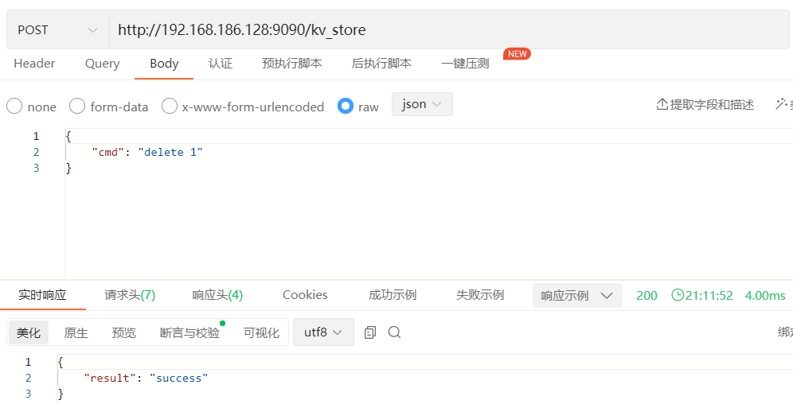
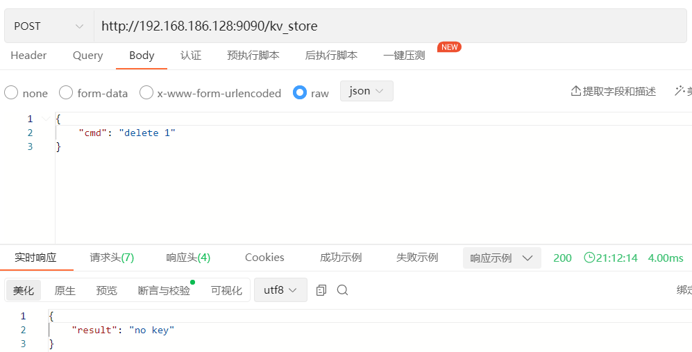

# K-V存储引擎文档

## 实现细节

`Storage`使用的K-V存储引擎基于经典的跳表结构。跳表具体的实现细节可自行查阅资料，这里不再赘述。

## 操作演示

### 插入操作

#### 插入新key

#### 更新数据

### 删除操作

#### 删除存在的key

#### 删除不存在的key

### 查询操作

#### 全查

#### 按key查

#### 查size

### 落盘操作

